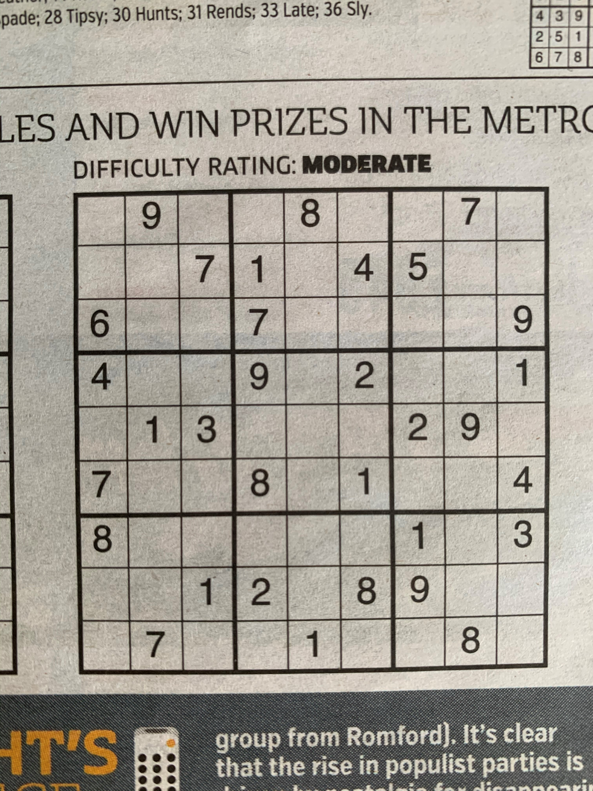
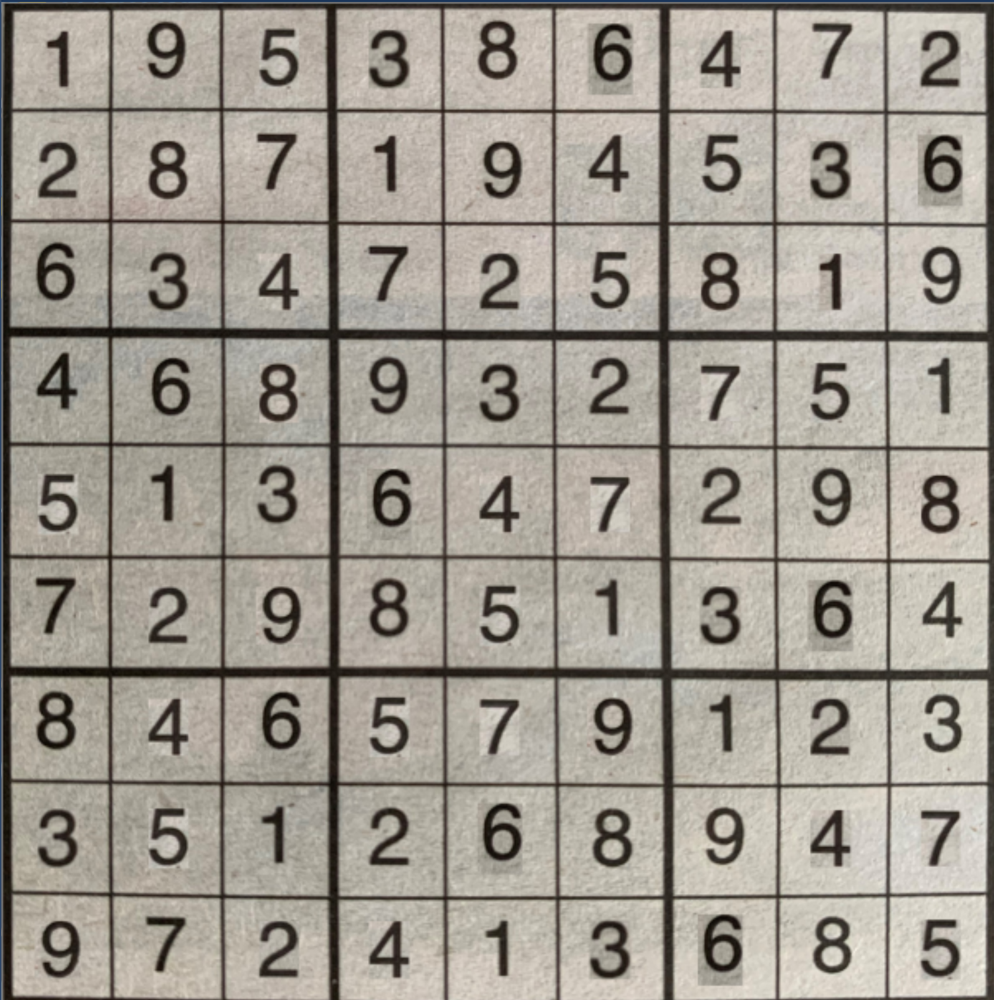

# Sudoku Solver

Completes a sudoku by applying backtracking

Added feature where image can be uploaded instead of inputting sudoku

This currently runs on windows and linux, if tesseract is installed at the specified path
Install necessary packages using requirements file

    pip install -r requirements.txt

Solve Sudoku by typing the following

    python main.py $Path_to_image
    

If we start with an image like this  
 

We first read in the image into the one line format so we get:
090080070007104500600700009400902001013000290700801004800000103001208900070010080

Then pass this into the solver which produces a similar one line output:
195386472287194536634725819468932751513647298729851364846579123351268947972413685

Finally, we project this back onto the original image for following result:
 

